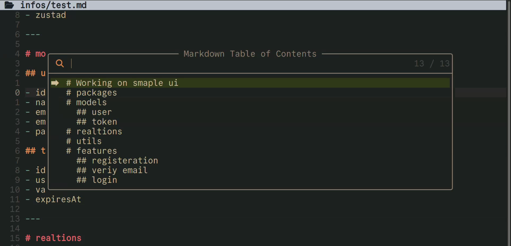

# markdown-toc.nvim

A lightweight, high-performance, plugin to access markdown file headings (Table Of Content) with auto integrations with Telescope

## 🚀 Features


✅ Auto integrations with Telescope if installed  and if not will use native vim.select


## 📦 Installation

```lua

vim.pack.add({
    "https://github.com/janecodelife/markdown-toc.nvim",
    "https://github.com/nvim-telescope/telescope.nvim" -- Optional
})

-- Setup and configure the plugin
require("markdown-toc").setup({
    min_level = 1, -- Include everything from level 1 (#)
    max_level = 6, -- Down to level 6 (######)
})

vim.keymap.set("n", "<leader>mo", "<cmd>MarkdownTOC<cr>", { desc = "Markdown Open TOC" })

```
## ⚙️ Configuration


| Option | Type | Default | Description |
| :--- | :--- | :--- | :--- |
| `min_level` | `number` | `1` | The minimum markdown heading depth to parse into the table of contents list. |
| `max_level` | `number` | `6` | The maximum markdown heading depth to parse into the table of contents list. |


---


## Video 📺

<p align="center">
  <a href="https://youtu.be/O9HuCR4MXR8">
    
  </a>
</p>


---

##  If Have A Question🤝 (Contact Me)

I will be there i am answer to all messages

- **X (Twitter)**: [https://x.com/janecodelife](https://x.com/janecodelife)
- **YouTube**: [https://www.youtube.com/@JaneCodeLife](https://www.youtube.com/@JaneCodeLife) 
- **Email**: [janecodelife@gmail.com](janecodelife@gmail.com)


# Thank You
